<picture>
  <source media="(prefers-color-scheme: dark)" srcset="https://raw.githubusercontent.com/trailofbits/vscode-weaudit/main/media/banner-dark-mode.png">
  <source media="(prefers-color-scheme: light)" srcset="https://raw.githubusercontent.com/trailofbits/vscode-weaudit/main/media/banner-light-mode.png">
  
</picture>

# weAudit - A collaborative code review tool for VSCode

### [Release Blogpost](https://blog.trailofbits.com/2024/03/19/read-code-like-a-pro-with-our-weaudit-vscode-extension/) | [Installation](#installation) | [Features](#features)

WeAudit is an essential extension in the arsenal of any code auditor.

With weAudit, you can bookmark regions of code to highlight issues, add notes, mark files as reviewed, and collaborate with your fellow auditors. Enhance your reporting workflow by writing the findings directly in VSCode, creating prefilled GitHub issues, and copying links. For the stats lovers, analyze your audit progress with the daily log, showing the number of files and LOC audited per day.

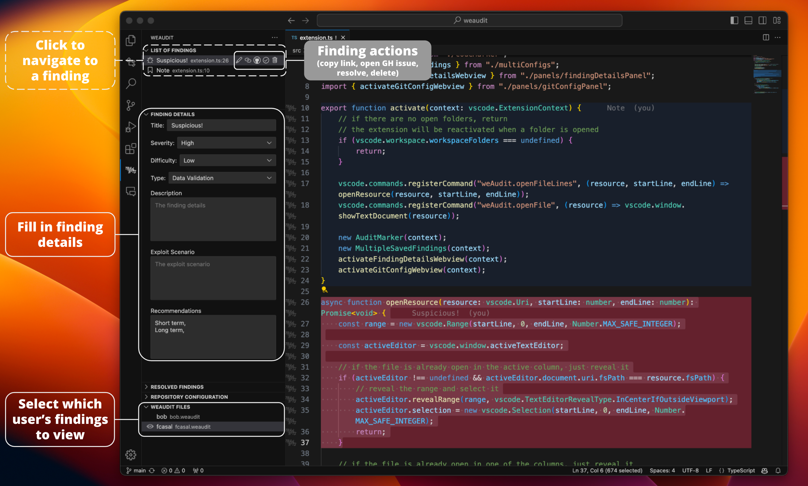

## Installation

Install weAudit directly from [weAudit @ VSCode Marketplace](https://marketplace.visualstudio.com/items?itemName=trailofbits.weaudit).

See the [Build and install](#build-and-install) section below for how to build and install from source.


## Features

-   [**Findings and Notes**](#findings-and-notes) - Bookmark regions of code to identify findings or to add audit notes.
-   [**Audited Files**](#audited-files) - Mark an entire file as reviewed.
-   [**Partially Audited Files**](#partially-audited-files) - Mark a region of code as reviewed.
-   [**Detailed Findings**](#detailed-findings) - Fill detailed information about a finding.
-   [**GitHub/Gitlab Issues**](#github-issues) - Create formatted GitHub or Gitlab issues with the Detailed Findings information.
-   [**Multi-region Findings**](#multi-region-findings) - Group multiple locations under a single finding.
-   [**Resolve and Restore**](#resolve-and-restore) - Resolved findings will not be highlighted in the editor but are still visible in the sidebar.
-   [**Copy Permalinks**](#copy-permalinks) - Copy GitHub permalinks to findings, or to a selected code region.
-   [**Daily Log**](#daily-log) - View a daily log of all the marked files and LOC per day.
-   [**View Mode**](#view-mode) - View findings in a list, or grouped by filename.
-   [**Multiple Users**](#multiple-users) - Findings can be viewed from multiple different users.
-   [**Hide Findings**](#hide-findings) - Hide all findings associated with a specific user.
-   [**Search & Filter Findings**](#search--filter-findings) - Search and filter the findings in the _List of Findings_ panel.
-   [**Export Findings**](#export-findings) - Export findings to a markdown file.
-   [**Drag & drop Findings and Locations**](#drag--drop-findings-and-locations) - Drag and drop findings and locations in the _List of Findings_ panel.
-   [**Settings**](#settings) - Customize colors.

---

### Findings and Notes

Findings and notes can be added to the current selection by calling the `weAudit: New Finding from Selection` or `weAudit: New Note from Selection` commands, or their respective keyboard shortcuts. The selected code will be highlighted in the editor, and an item added to the _List of Findings_ view in the sidebar.

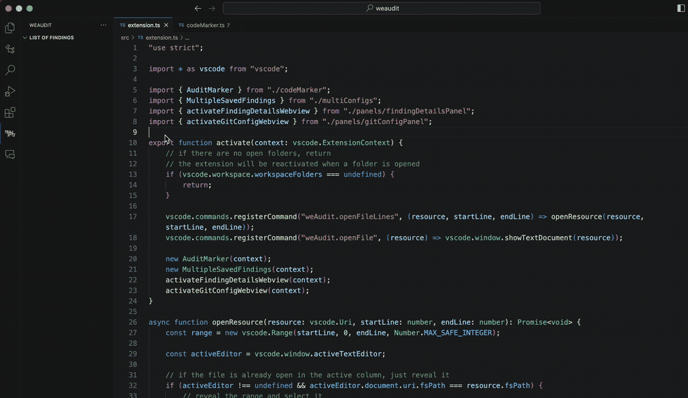

Clicking on a finding in the _List of Findings_ view will navigate to the region of code previously marked.

A file with a finding will have a `!` annotation that is visible both in the file tree, and in the file name above the editor.


The highlighted colors can be customized in the [settings](#settings).

### Audited Files

After reviewing a file, you can mark it as audited by calling the `weAudit: Mark File as Reviewed` command, or its respective keyboard shortcut. The whole file will be highlighted and annotated with a `✓` in the file tree, and in the file name above the editor.

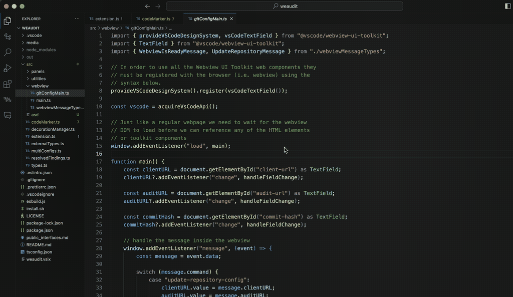

The highlighted color can be customized in the [settings](#settings).

### Partially Audited Files

You can also partially mark a file as reviewed by selecting a region of code and calling the `weAudit: Mark Region as Reviewed` command. Partially reviewed regions can be merged together by calling the same command on a region containing.
If called on a region:
 - that matches an already audited region, the region will be unmarked.
 - containing an already audited region, the region will be extended.
 - contained in an already audited region, the region will be split into two regions.

Once a file is marked as audited with the `weAudit: Mark File as Reviewed` command, all partial regions will be discarded.

The following gif showcases all the scenarios described:


The highlighted color can be customized in the [settings](#settings).

#### Navigation Between Partially Audited Regions

You can quickly navigate through all partially audited regions in your workspace using the `weAudit: Navigate to Next Partially Audited Region` command. This command will cycle through each partially audited region across all files, helping you efficiently review your progress.

### Detailed Findings

You can fill detailed information about a finding by clicking on it in the _List of Findings_ view in the sidebar. The respective _Finding Details_ panel will open, where you can fill the information.

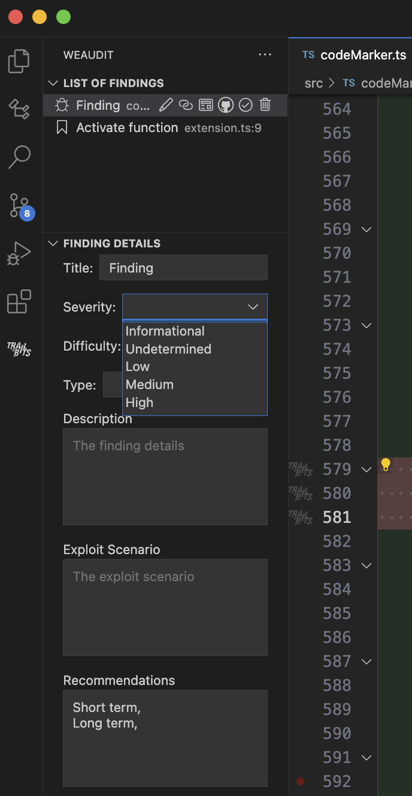

### GitHub/Gitlab Issues

You can create a GitHub/Gitlab issue with the detailed findings information by clicking on the corresponding `Open Remote Issue` button in the _List of Findings_ panel. A browser window in will open prompting you to open the issue with the prefilled information from the _Finding Details_ panel.

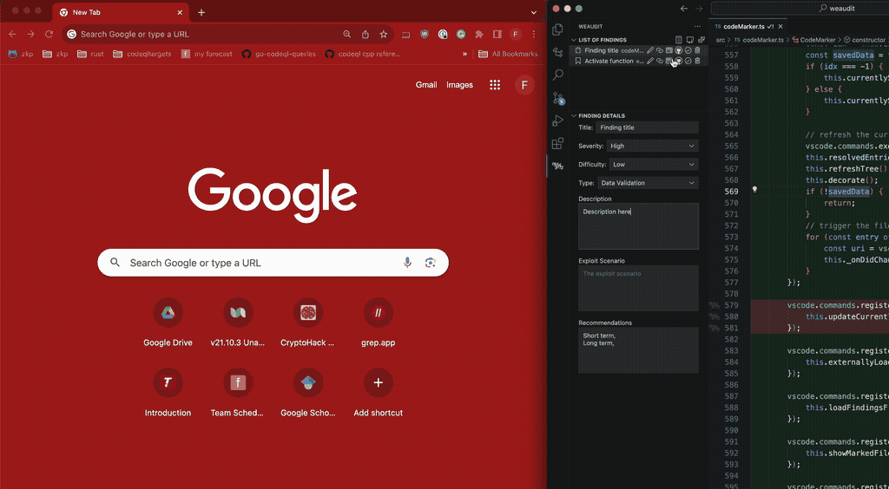

### Multi-region Findings

You can add multiple regions to a single finding or note. Once you select the code region to be added, call the `weAudit: Add Region to a Finding` and select the finding to add the region to from the quick pick menu. The regions will be highlighted in the editor, and the finding will be updated in the _List of Findings_ panel.

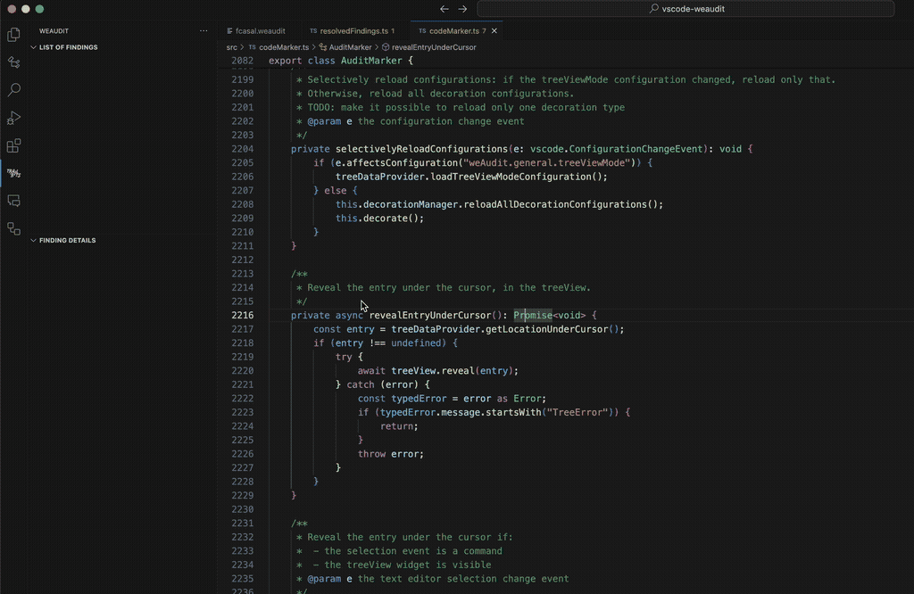

### Resolve and Restore

You can resolve a finding by clicking on the corresponding `Resolve` button in the _List of Findings_ panel. The finding will no longer be highlighted in the editor, but will still be visible in the _Resolved Findings_ panel. You can restore a resolved finding by clicking on the corresponding `Restore` button in the _Resolved Findings_ panel.

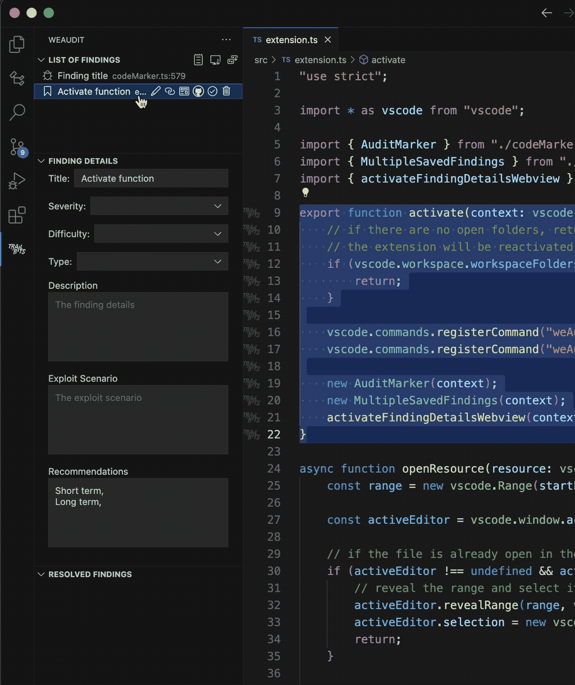

### Copy Permalinks

Copy the Audit permalink by clicking on the corresponding `Copy Audit Permalink` button in the _List of Findings_ panel.

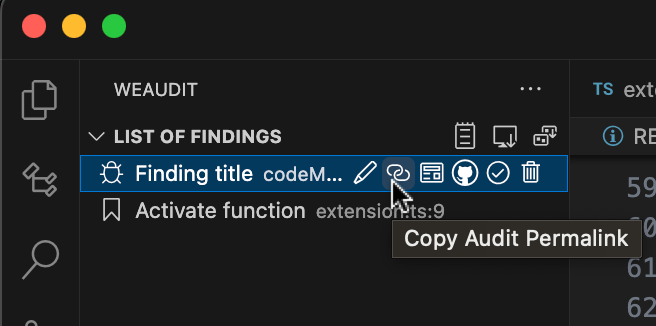

Copy a permalink to any code region by right clicking and selecting one of the `weAudit: Copy Permalink` options in the context menu.

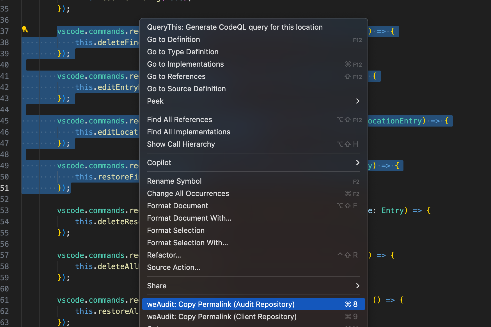

### Daily Log

You can view a daily log of all the marked files and LOC per day by clicking on the `Daily Log` button in the _List of Findings_ panel.

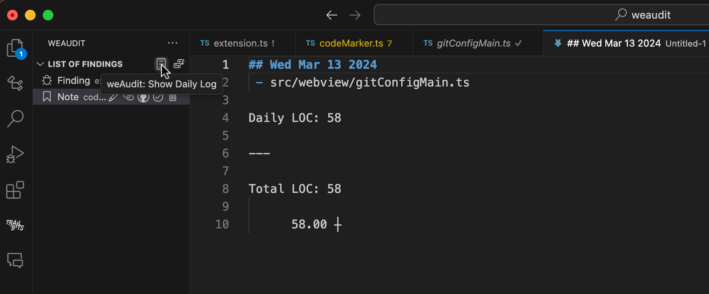

You can also view the daily log by calling the `weAudit: Show Daily Log` command in the command pallette, or its respective keyboard shortcut.

### View Mode

You can view findings in a list, or grouped by filename by clicking on the `View Mode` button in the _List of Findings_ panel.

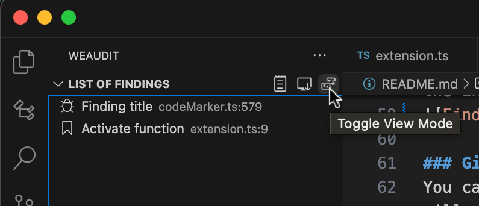


### Multiple Users

You can share the weAudit file with you co-auditors to share findings. This file is located in the `.vscode` folder in your workspace named `$USERNAME.weaudit`.

In the `weAudit Files` panel, you can toggle to show or hide the findings from each user by clicking on the entries.
There are color settings for other user's findings and notes, and for your own findings and notes.


### Hide Findings
You can hide all findings associated with a specific user by clicking on that user's name on the  `weAudit Files` panel.

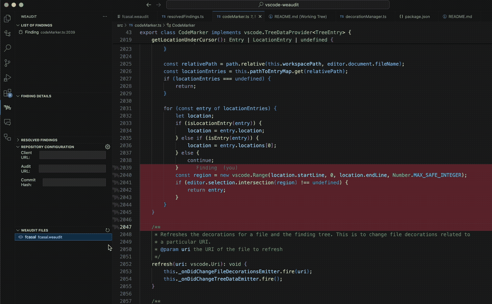

### Search & Filter Findings
You can search for and filter the findings in the `List of Findings` panel by calling the `weAudit: Search and Filter Findings` command.


### Export Findings
You can export the findings to a markdown file by calling the `weAudit: Export Findings as Markdown` command.

### Drag & Drop Findings and Locations
You can drag and drop findings and locations in the _List of Findings_ panel to:
- drag a location (from a multi location finding) into another finding;
- drag a location (from a multi location finding) to create a separate finding;
- drag a multi-location finding into another finding, moving all locations into it;
- reorder locations within a single finding.


### Settings

#### Background colors

Each background color is customizable via the VSCode settings page. Write as #RGB, #RGBA, #RRGGBB or #RRGGBBAA:

-   `weAudit.auditedColor`: Background color for files marked as audited
-   `wAudit.{other,own}findingColor`: Background color for findings
-   `weAudit.{other,own}noteColor`: Background color for notes

#### Keybindings

You can configure the keybindings to any of the extension's commands in the VSCode settings. The default shortcuts are:

-   `weAudit.addFinding`: Add Selected Code To Findings: `cmd + 3`
-   `weAudit.addNote`: Add Selected Code To Notes: `cmd + 4`
-   `weAudit.deleteLocationUnderCursor`: Delete Finding Under Cursor: `cmd + 5`
-   `weAudit.editEntryUnderCursor`: Edit Finding Under Cursor: `cmd + 6`
-   `weAudit.toggleAudited`: Mark Current File As Reviewed: `cmd + 7`
-   `weAudit.addPartiallyAudited`: Mark Region As Reviewed: `cmd + shift + 7`
-   `weAudit.copySelectedCodePermalink`: Copy Permalink (for the Selected Code Region): `cmd + 8`
-   `weAudit.navigateToNextPartiallyAuditedRegion`: Navigate to Next Partially Audited Region: `cmd + 0`

## WeAudit Concepts

-   **Findings and Notes**: A region of code that is of interest. Findings can be marked as "Resolved" or "Restored". There is no actual difference between findings and notes, except that they can be assigned different colors and that findings are displayed before notes in the _List of Findings_ panel.
-   **Audited Files**: A file that has been reviewed. This is a binary state, either a file is audited or it is not.
-   **Audit and Client Repositories**:
    -   **Audit Repository**: The repository where issues should be created. This is usually the Trail of Bits repository with the code being audited.
    -   **Client Repository**: The repository that the Audit Repository mirrors. This is used to create permalinks to include in the report.


## Development

### Build and install

To build and install a new vsix file run the following script:

```bash
npm install
./install.sh
```

### Linting and Formatting

We use ESLint and Prettier to enforce a consistent code style.

```bash
# run ESLint
npx eslint -c .eslintrc.json .

# run Prettier
npx prettier --write .
```